# Laboratorio N°6: DevOps Moderno con GitHub Actions y Azure DevOps

**Sistemas Operativos**

Horacio Díaz
Sistemas Operativos

---

## Introducción

Este documento reúne la investigación solicitada en la etapa de Pre-Laboratorio de la guía "DevOps Moderno con GitHub Actions y Azure DevOps", correspondiente a la asignatura Sistemas Operativos. Se desarrollan los conceptos fundamentales de DevOps y del ciclo CI/CD, se amplía la comparación entre las principales plataformas de automatización disponibles, y se define el vocabulario técnico de base necesario para abordar la configuración de los pipelines de integración y despliegue continuo que se implementarán durante el desarrollo del laboratorio.

La investigación se organiza en las tres partes propuestas por la guía: introducción conceptual a DevOps, comparación de plataformas de CI/CD, y vocabulario técnico base (YAML, runners, workflows, artifacts, SSH, deployments y secretos).

## Parte 1: Introducción a DevOps

### ¿Qué es DevOps?

DevOps es un conjunto de prácticas, herramientas y una cultura de trabajo que busca integrar a los equipos de Desarrollo (Dev) y Operaciones (Ops), tradicionalmente separados, en un único flujo de trabajo colaborativo y continuo. Su objetivo es acortar el ciclo de vida del desarrollo de software y entregar aplicaciones y mejoras con mayor frecuencia, calidad y confiabilidad.

En lugar de que Desarrollo entregue el código a Operaciones al final del proceso, ambos equipos comparten la responsabilidad de todo el ciclo de vida del software: planificación, desarrollo, pruebas, despliegue y monitoreo en producción. DevOps se apoya fuertemente en la automatización mediante pipelines de CI/CD, en la infraestructura como código y en una cultura de mejora continua y comunicación constante entre equipos.

### Diferencia entre CI y CD

Si bien suelen mencionarse juntas como "CI/CD", integración continua y entrega o despliegue continuo son etapas distintas de la automatización. CD, además, puede referirse a dos conceptos relacionados pero distintos entre sí: Continuous Delivery y Continuous Deployment.

- **CI (Continuous Integration, Integración Continua):** práctica de desarrollo en la que los integrantes de un equipo integran su código a un repositorio compartido de forma frecuente, varias veces al día. Cada integración dispara automáticamente un proceso de build y ejecución de pruebas, lo que permite detectar errores de integración lo antes posible.
- **Continuous Delivery (Entrega Continua):** el código, luego de pasar por CI, queda automáticamente en condiciones de ser desplegado a producción en cualquier momento, aunque el paso final de despliegue requiere una aprobación manual de un responsable del equipo.
- **Continuous Deployment (Despliegue Continuo):** cada cambio que supera exitosamente todas las etapas del pipeline, build y pruebas, se despliega automáticamente a producción, sin intervención humana.

En síntesis: CI se enfoca en integrar y validar el código de forma constante; CD se enfoca en automatizar la entrega de ese código ya validado hasta que llega al usuario final.

### Beneficios de la automatización

- Reduce errores humanos en tareas repetitivas, como builds y despliegues manuales.
- Acelera la velocidad de entrega, permitiendo releases más frecuentes y de menor tamaño.
- Detecta errores más temprano en el ciclo de desarrollo, principio conocido como "shift left".
- Garantiza consistencia: el mismo proceso se ejecuta exactamente igual en cada corrida.
- Mejora la trazabilidad, dejando un historial completo de builds, pruebas y despliegues.
- Libera tiempo del equipo de tareas operativas repetitivas para enfocarse en problemas de mayor valor.
- Facilita el rollback rápido ante fallos detectados en producción.
- Mejora la colaboración y la confianza entre los equipos de desarrollo y operaciones.

### ¿Qué es un pipeline?

Un pipeline es una secuencia automatizada y ordenada de etapas (stages) o trabajos (jobs) que el código atraviesa desde que se sube al repositorio hasta que llega a producción. Habitualmente incluye etapas como validación o lint del código, compilación (build), ejecución de pruebas automáticas, empaquetado del artifact y despliegue.

Si alguna etapa falla, el pipeline se detiene automáticamente para evitar que código defectuoso avance a las siguientes fases. Los pipelines se definen como código, generalmente en YAML, y se versionan junto al proyecto, lo que permite revisarlos, reutilizarlos y controlarlos igual que a cualquier otro archivo del repositorio.

### ¿Qué es Infrastructure as Code (IaC)?

Es la práctica de definir, aprovisionar y gestionar infraestructura (servidores, redes, bases de datos, balanceadores, etc.) mediante archivos de configuración o código, en lugar de procesos manuales o configuraciones hechas a mano desde una interfaz gráfica.

Al tratar la infraestructura como código, esta puede versionarse en Git, revisarse mediante pull requests, reutilizarse mediante plantillas y desplegarse de forma reproducible en cualquier entorno. Ejemplos de herramientas de IaC son Terraform, Ansible, Azure Resource Manager (ARM) Templates, Bicep y AWS CloudFormation.

### ¿Qué es un despliegue automatizado?

Es el proceso mediante el cual una nueva versión de una aplicación se instala, configura y pone en funcionamiento en un entorno determinado, por ejemplo staging o producción, sin que una persona deba ejecutar los pasos manualmente.

Un pipeline de CD se encarga de tareas como descargar el artifact generado por CI, copiar los archivos al servidor, por ejemplo vía SSH, aplicar configuraciones o migraciones necesarias, reiniciar el servicio, y finalmente verificar que el despliegue fue exitoso mediante una validación automática, como un endpoint /health que responde 200 OK.

## Parte 2: Investigación de Plataformas

A continuación se amplía el cuadro comparativo propuesto en la guía del laboratorio, incorporando el origen de cada herramienta, su modelo de configuración, el tipo de runners o agentes que utiliza, y sus fortalezas principales:

| Plataforma | Integración / Origen | Configuración | Runners / Agentes | Fortalezas clave |
|---|---|---|---|---|
| GitHub Actions | Integrado nativamente en repositorios de GitHub (Microsoft) | YAML en .github/workflows/ | Alojados (Linux, Windows, macOS) o autoalojados | Curva de entrada baja, enorme marketplace de actions reutilizables; ideal si el código ya vive en GitHub |
| Azure DevOps | Plataforma independiente de Microsoft; se conecta con GitHub, Azure Repos u otros | YAML o editor visual (pipelines clásicos) | Alojados por Microsoft o autoalojados (agent pools) | Suite empresarial completa: Boards, Repos, Pipelines, Artifacts y Test Plans; fuerte integración con Azure |
| GitLab CI/CD | Integrado nativamente en repositorios de GitLab | YAML (.gitlab-ci.yml) | GitLab.com (runners compartidos) o autoalojados | Todo el ciclo DevOps en una sola plataforma: repos, CI/CD, registry de contenedores y seguridad integrada |
| Bitbucket Pipelines | Integrado nativamente en repositorios de Bitbucket (Atlassian) | YAML (bitbucket-pipelines.yml) | Alojados por Atlassian o autoalojados (runners) | Integración directa con Jira y el resto del ecosistema Atlassian |

Las cuatro plataformas resuelven el mismo problema: automatizar build, test y despliegue. Sin embargo, difieren en dónde vive el código fuente de forma nativa y en qué tan "empresarial" es su enfoque. Para este laboratorio, la guía sugiere GitHub Actions como flujo principal por su simplicidad de configuración y su integración directa con el repositorio, dejando Azure DevOps como alternativa comparativa.

## Parte 3: Investigación Técnica Base

### ¿Qué es YAML?

YAML ("YAML Ain't Markup Language") es un formato de serialización de datos legible por humanos, ampliamente usado en archivos de configuración. A diferencia de JSON o XML, se basa en la indentación (con espacios, nunca tabs) para representar la jerarquía de los datos, y utiliza una sintaxis simple de pares clave y valor, listas y mapas anidados.

Es el formato estándar utilizado para definir pipelines en GitHub Actions, Azure DevOps y GitLab CI/CD, así como en herramientas como Docker Compose y Kubernetes, debido a su legibilidad y bajo nivel de ruido sintáctico frente a otros formatos.

### ¿Qué es un runner o agente?

Es la máquina, física, virtual o un contenedor, donde efectivamente se ejecutan los jobs definidos en el pipeline: clona el repositorio, instala dependencias, corre las pruebas, compila el proyecto, etc. Existen dos modalidades principales:

- **Alojado (hosted):** proporcionado por la propia plataforma, GitHub o Azure, es efímero, se crea y destruye en cada ejecución, y viene con herramientas comunes preinstaladas.
- **Autoalojado (self hosted):** una máquina propia que el usuario registra como runner, útil cuando se necesita hardware específico, acceso a una red interna, o mayor control sobre el entorno de ejecución.

### ¿Qué es un workflow?

Es un proceso automatizado, definido como código (típicamente en un archivo YAML), compuesto por uno o más jobs y disparado ante determinados eventos del repositorio: un push, un pull request, una programación (schedule) o una ejecución manual. En GitHub Actions, por ejemplo, cada archivo dentro de .github/workflows/ define un workflow independiente. Es la unidad de más alto nivel que agrupa toda la automatización de CI/CD de un proyecto.

### ¿Qué es un artifact?

Es un archivo o conjunto de archivos generado durante la ejecución de un pipeline, por ejemplo un binario compilado, un paquete ZIP o TAR, una imagen Docker, o un reporte de resultados de pruebas, que se almacena temporalmente para ser reutilizado en etapas posteriores del mismo pipeline, como el despliegue, o descargado para su revisión.

### ¿Qué es SSH?

SSH (Secure Shell) es un protocolo de red criptográfico que permite acceder y ejecutar comandos de forma segura sobre una máquina remota, a través de una conexión cifrada. Se utiliza habitualmente para la administración remota de servidores y la transferencia segura de archivos mediante SCP o SFTP.

En el contexto de CD, es el mecanismo típico mediante el cual el pipeline se conecta al servidor de producción para copiar los archivos desplegados y reiniciar el servicio correspondiente, sin exponer credenciales en texto plano.

### ¿Qué es un deployment?

Un deployment (despliegue) es el proceso de poner en funcionamiento una versión específica de una aplicación en un entorno determinado (desarrollo, staging o producción), lo que incluye instalar dependencias, aplicar configuraciones y arrancar el servicio correspondiente.

Vale aclarar que, en el ecosistema de Kubernetes, "Deployment" es además un objeto concreto que gestiona réplicas de pods; en el contexto general de DevOps, sin embargo, el término se usa para referirse al acto de desplegar una aplicación.

### ¿Qué es un secreto o variable segura?

Es información sensible: contraseñas, tokens de API, claves privadas SSH, cadenas de conexión a bases de datos, que un pipeline necesita para funcionar, pero que no debe quedar expuesta en el código fuente ni en los logs de ejecución.

Las plataformas de CI/CD ofrecen mecanismos para almacenar estos valores de forma cifrada, por ejemplo GitHub Secrets o los Variable Groups y Azure Key Vault de Azure DevOps, y los inyectan como variables de entorno únicamente durante la ejecución del pipeline, evitando que aparezcan en el repositorio o queden visibles en texto plano.

## Desarrollo del laboratorio

### Partes 1 y 2 – Creación del repositorio y aplicación

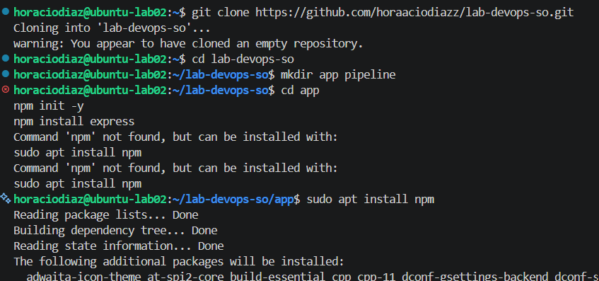

Con git clone clonamos el repositorio lab-devops-so y con sudo apt install npm instalamos npm.

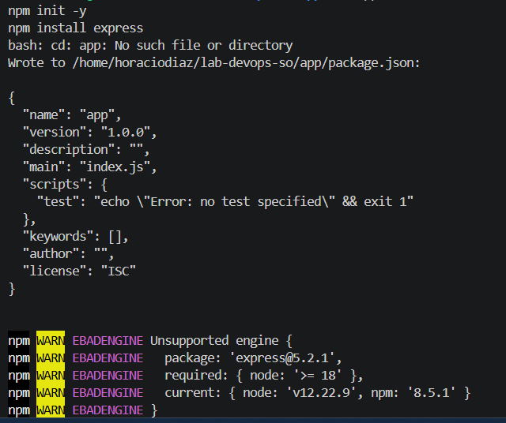

Aquí instalamos express, para tener una mini-aplicación que devuelva Hola Mundo DevOps

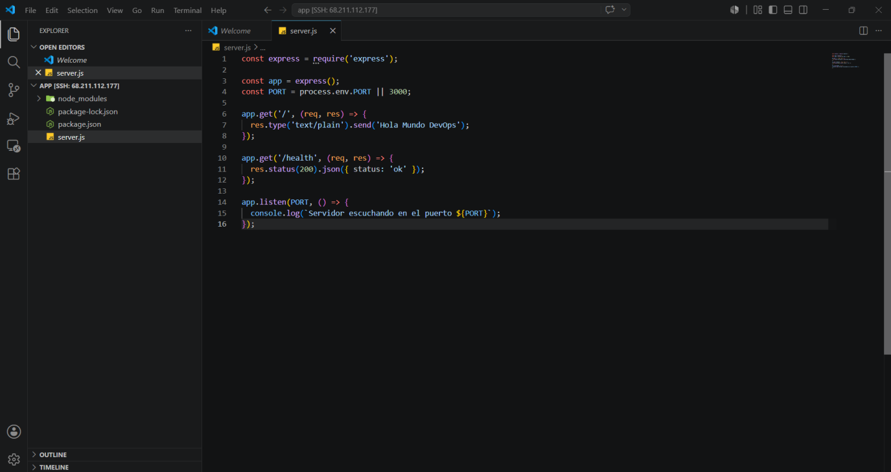

Aquí creamos el archivo server.js en el que creamos un servidor con express que devuelva Hola Mundo DevOps.

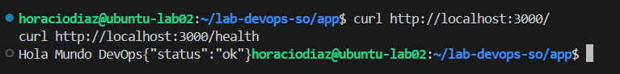

Al hacer un request a la aplicación, efectivamente devuelve Hola Mundo DevOps, por lo que funciona como esperado.

### Parte 3 — Configurar CI

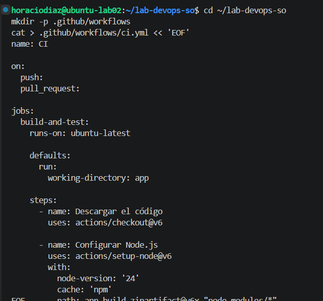

Lo que se está creando es el archivo de definición del pipeline de Integración Continua (CI). GitHub Actions no ejecuta pipelines desde cualquier ubicación: solo reconoce archivos YAML ubicados en la carpeta .github/workflows/ dentro del repositorio.

**Los dos comandos de terminal**

1. mkdir -p .github/workflows crea esa carpeta específica. El flag -p hace que se creen los directorios intermedios que falten (en este caso, primero .github y adentro workflows) sin devolver error si ya existen.
2. cat > .github/workflows/ci.yml << 'EOF' ... EOF es un heredoc: una forma de escribir el contenido de un archivo directamente desde la terminal, sin necesidad de abrir un editor de texto. Todo lo que se escribe entre la primera línea y el EOF de cierre se guarda tal cual dentro de ci.yml.

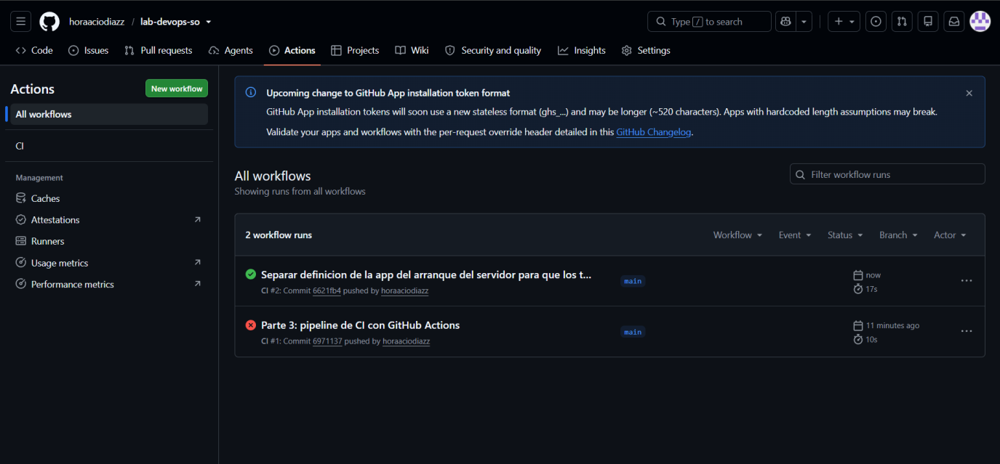

El problema fue que server.js mezclaba la definición de la aplicación Express con el arranque del servidor, y ese arranque se disparaba igual al importar el archivo desde los tests, dejando la app en un estado que rompía al intentar levantarla de nuevo con app.listen(0) dentro de node --test. La solución fue separar responsabilidades: server.js pasó a exportar solo la aplicación, sin efectos secundarios, e index.js quedó como único punto de entrada encargado de levantar el servidor. Eso es justo lo que confirma la captura: el run CI #1, correspondiente al commit con el problema, quedó en rojo, mientras que el run CI #2, disparado por el commit con la corrección, terminó en verde, es decir que el pipeline ya corre los tests exitosamente en GitHub Actions.

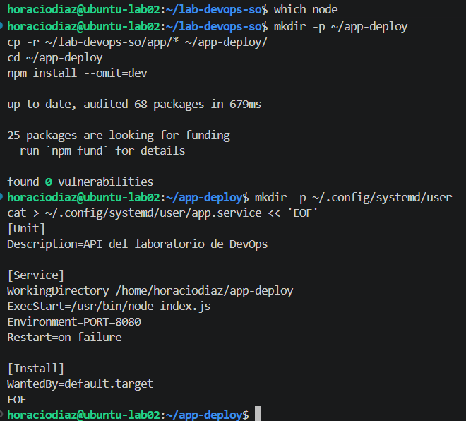

Esto crea un servicio de systemd, que es el mecanismo estándar de Linux para manejar procesos que tienen que quedar corriendo en segundo plano de forma permanente, en vez de depender de una terminal abierta.

Primero se copió la aplicación (sin las dependencias de desarrollo, con --omit=dev) a ~/app-deploy, el directorio que va a quedar dedicado exclusivamente a la versión en ejecución, separado de ~/lab-devops-so que es la copia de trabajo de Git. Después, el bloque cat > ... << 'EOF' escribió el archivo app.service, que le indica a systemd tres cosas: dónde está la aplicación (WorkingDirectory), qué comando la levanta (ExecStart, apuntando al Node real confirmado con which node) y qué hacer si el proceso se cae (Restart=on-failure, para que se reinicie solo).

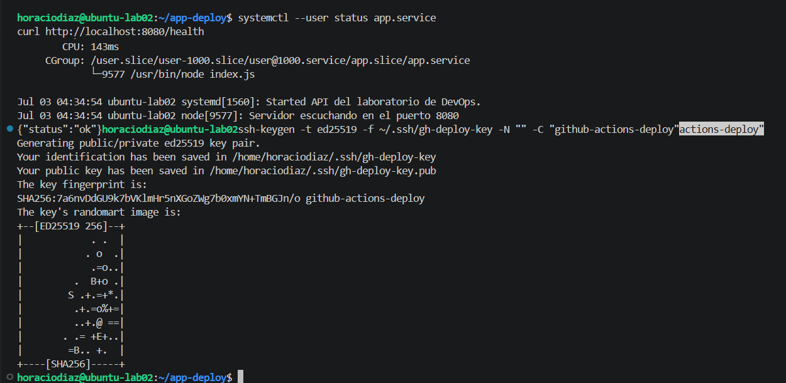

Se generó un par de claves SSH dedicado exclusivamente al pipeline de despliegue, mediante el comando ssh-keygen -t ed25519 -f ~/.ssh/gh-deploy-key -N "" -C "github-actions-deploy". Se utilizó el algoritmo ed25519 por ser más liviano y seguro que las alternativas RSA tradicionales, y se omitió la passphrase (-N "") dado que GitHub Actions no puede ingresarla de forma interactiva durante la ejecución del pipeline. El comando generó dos archivos: la clave privada (gh-deploy-key), que se carga como secreto en el repositorio de GitHub, y la clave pública (gh-deploy-key.pub), que se autoriza en la propia máquina virtual para permitir el acceso. El fingerprint y el randomart que se muestran en la salida son representaciones del hash de la clave generada, utilizadas para verificar visualmente su identidad.

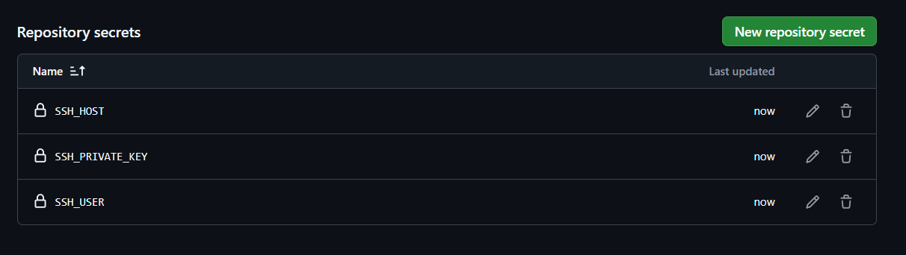

Se configuraron en el repositorio de GitHub los tres secretos que utiliza el pipeline de despliegue para autenticarse contra la máquina virtual: SSH_HOST (dirección IP pública del servidor), SSH_PRIVATE_KEY (clave privada del par generado específicamente para este propósito) y SSH_USER (usuario del sistema en la VM). GitHub cifra estos valores y no vuelve a mostrarlos una vez guardados, por lo que la sección solo lista sus nombres.

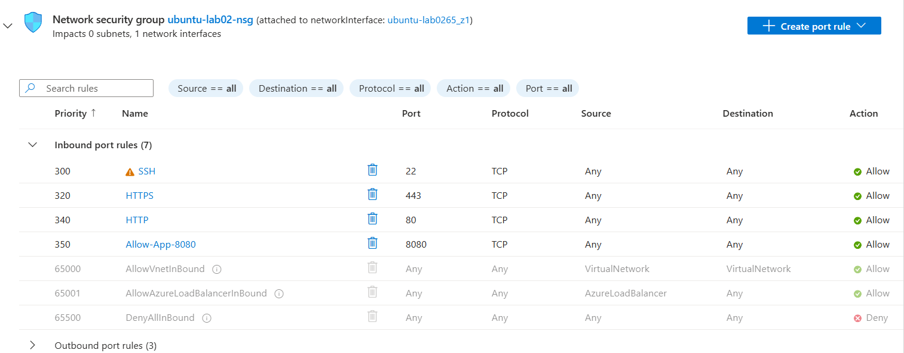

Se creó una regla de entrada en el Network Security Group ubuntu-lab02-nsg, denominada Allow-App-8080, que habilita el tráfico TCP entrante hacia el puerto 8080 desde cualquier origen. Esta apertura es necesaria porque la aplicación expone su servicio HTTP en ese puerto, y sin la regla correspondiente el tráfico externo sería descartado por la regla DenyAllInBound que aplica por defecto a todo tráfico no contemplado explícitamente. La captura muestra la regla activa con prioridad 350, junto a las reglas preexistentes para SSH (22), HTTPS (443) y HTTP (80).

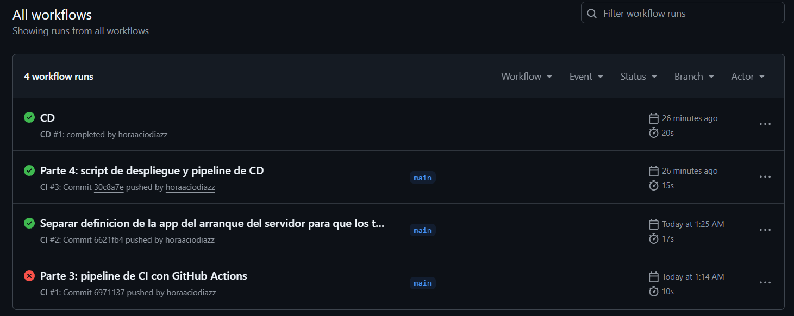

El run más reciente corresponde a CD #1, finalizado exitosamente en 20 segundos, disparado automáticamente mediante workflow_run al completarse con éxito CI #3 (15 segundos), asociado al commit que incorporó el script de despliegue y el workflow de CD.

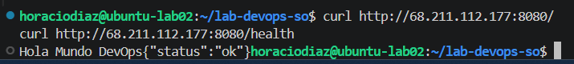

Se verificó la accesibilidad pública de la aplicación consultando ambos endpoints directamente sobre la dirección IP de la máquina virtual, sin pasar por localhost ni por la propia VM. La solicitud a la raíz (/) devolvió el texto Hola Mundo DevOps, y la solicitud a /health devolvió {"status":"ok"} con código 200.

## Post-lab

**1. ¿Qué ventajas ofrece DevOps frente al despliegue manual?**

El pipeline construido en este laboratorio despliega automáticamente ante cada push a la rama principal, sin intervención manual: no hace falta conectarse por SSH, copiar archivos ni reiniciar el servicio a mano. Además, incorpora un mecanismo de control que el despliegue manual no ofrece por sí solo: si las pruebas automáticas fallan, el pipeline de CD ni siquiera se ejecuta, evitando que código defectuoso llegue a producción. Esto se observó directamente durante el desarrollo: la ejecución CI #1 falló por la ausencia de un archivo de pruebas, y en consecuencia el despliegue nunca se disparó.

**2. ¿Qué problemas podrían ocurrir sin automatización?**

Un despliegue manual depende de que la persona responsable no omita ningún paso (instalar dependencias, reiniciar el servicio, verificar que el cambio haya tenido efecto), lo cual es propenso a errores humanos, especialmente bajo presión de tiempo. Sin una etapa de pruebas obligatoria, código con errores podría desplegarse directamente a producción sin que nadie lo advierta hasta que un usuario lo reporte.

**3. ¿Qué parte del pipeline fue más compleja?**

La etapa de CD resultó considerablemente más compleja que la de CI, principalmente porque involucra capas de infraestructura que no son visibles desde el archivo YAML del workflow. Un ejemplo concreto fue la configuración de systemctl --user para que funcionara correctamente al ser invocado de forma no interactiva por SSH, lo que requirió establecer explícitamente la variable XDG_RUNTIME_DIR.

**4. ¿Qué mejorarían en un ambiente empresarial real?**

Se incorporaría un ambiente de staging previo a producción, en lugar de desplegar directamente sobre un único servidor. El pipeline actual no contempla una estrategia de rollback automático: si una versión desplegada fallara la verificación de /health, un ambiente empresarial debería revertir automáticamente a la última versión funcional en lugar de dejar el servicio caído.

**5. ¿Qué riesgos de seguridad identificaron?**

La regla de entrada para SSH en el NSG permite conexiones desde cualquier origen, algo que la propia Azure señala como riesgo. La clave privada utilizada por el pipeline se generó sin passphrase, condición necesaria para que GitHub Actions pueda autenticarse sin intervención humana, pero que implica que quien obtenga esa clave privada obtiene acceso inmediato al servidor sin ningún factor adicional

**6. ¿Cómo escalarían esta solución?**

La solución actual depende de una única máquina virtual, lo que representa un punto único de falla. Escalarla implicaría distribuir la aplicación entre múltiples instancias detrás de un balanceador de carga, y migrar de un servicio systemd corriendo directamente sobre la VM hacia contenedores orquestados (Docker con Kubernetes, o un servicio administrado como Azure Container Apps)
